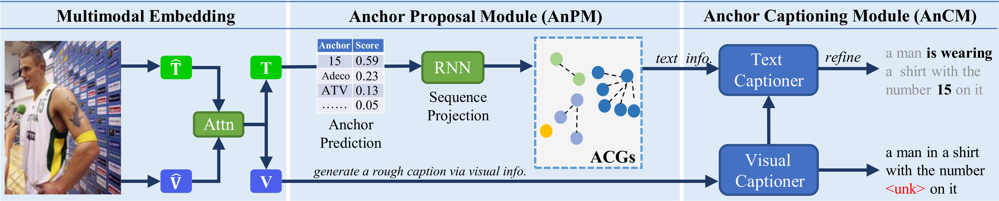

# Towards Accurate Text-based Image Captioning with Content Diversity Exploration

Pytorch implementation for the CVPR 2021 paper:  [Towards Accurate Text-based Image Captioning with Content Diversity Exploration](https://github.com/guanghuixu/AnchorCaptioner/blob/main/docs/source/projects/TextCap_CVPR.pdf)

<p align="center">

</p>
## Install

Clone this repository, and build it with the following command.

```
# activate your own conda environment
# [Alternative]
# conda env create -f textcap.yaml
# conda activate textcap

git clone git@github.com:guanghuixu/AnchorCaptioner.git
cd AnchorCaptioner
python setup.py build develop
```

## Data and running scripts

Some specific annotations required by our method are provided in [here](https://github.com/guanghuixu/AnchorCaptioner/releases/download/data/data.zip). More details please refer to [projects/M4C_Captioner/README.md](https://github.com/guanghuixu/AnchorCaptioner/blob/project/m4c_captioner_pre_release/projects/M4C_Captioner/README.md)

## Citation

If you use any part of our code in your research, please cite our paper:

```BibTex
@InProceedings{xu2021textcap,
  title = {Towards Accurate Text-based Image Captioning with Content Diversity Exploration},
  author = {Guanghui Xu and Mingkui Tan and Shuaicheng Niu and Yucheng Luo and Qing Du and Qi Wu},
  booktitle = {The IEEE Conference on Computer Vision and Pattern Recognition},
  year = {2021}
}
```

## Acknowledgment

The code is greatly inspired by the [MMF](https://mmf.readthedocs.io/en/latest/) and [M4C-Captioner](https://github.com/ronghanghu/mmf).

